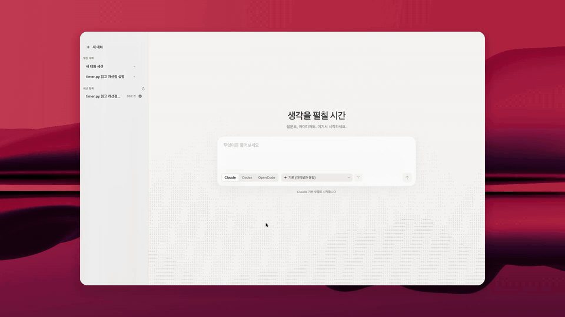
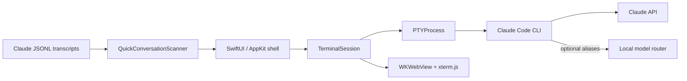

# Fine

[](https://github.com/NEWBIE0413/Fine/raw/refs/heads/main/Assets/fine-demo.mp4)

[Watch the full demo · 1080p / 60 fps](https://github.com/NEWBIE0413/Fine/raw/refs/heads/main/Assets/fine-demo.mp4)

Fine is a lightweight native macOS workspace for long-running agent
conversations. It combines a translucent conversation index with a focused
xterm.js workspace, while every conversation remains a real resumable provider
session.

## Why Fine

Terminal multiplexers are powerful, but they are not designed around
conversation history. Fine treats the transcript as the durable object:

- open a blank or prompted conversation in one step;
- choose the harness per conversation: Claude Code, stock Codex, or OpenCode;
- resume Claude, Codex, and OpenCode conversations by their native session IDs;
- restore the exact model and effort used by that transcript;
- keep several live conversations in native macOS windows;
- reopen the exact active tabs and selected conversation after an app restart;
- route Claude-compatible model aliases through an optional local gateway.

Fine intentionally stays small. There is no embedded database, account layer,
Electron runtime, or background terminal server.

## Interface

- **Native AppKit shell** with independent macOS windows and restoration.
- **Glass conversation rail** with full-row click targets, drag insertion guides,
  and a sliding selection block.
- **Quiet ASCII landscape** rendered on a fixed character grid behind the new-chat composer.
- **Demand-paged history** across Claude, Codex, and OpenCode with compact monochrome logos.
- **Flat white terminal canvas** with WebGL-accelerated xterm.js rendering.
- **Compact terminal chrome** showing the active provider, model, and effort.
- **Clean Claude surface** that replaces the verbose built-in footer hint.
- **Korean-first labels** with native IME composition and CJK-safe rendering.

## Engineering highlights

### Real PTY lifecycle

Each tab owns a direct pseudo-terminal process. Fine propagates terminal
resizes, handles process-group cleanup, and prevents detached Claude children
from surviving a closed window.

### Transcript-aware resume

Fine indexes Claude's local JSONL metadata and reads Codex/OpenCode session
metadata from their read-only local stores, preserving each conversation's
harness, model, and effort. Resume launches
explicitly clear inherited child-session markers so future transcripts remain
durable.

### Terminal parity

Every conversation is the command you would type. The default model option
launches plain `ccv -y`, `codex`, or `opencode` with no model or effort flag and no
router, so each harness applies its own settings. Sessions start
from an interactive login shell, so a Finder-launched Fine inherits the same
`~/.zshrc` environment as a terminal window: provider keys, the standalone
`opencode` ahead of Homebrew's, and the same `ccv`.

### Native model routing

Claude models run directly. Codex, Kimi, Gemini, Alibaba, OpenRouter, and
NVIDIA aliases can be discovered from a local Anthropic-compatible router at
`127.0.0.1:4141`. OpenCode models come from `opencode models`, which lists
only what `opencode.json` whitelists. The Codex harness runs the stock Codex CLI
directly and never uses that router. The terminal still runs the agent
itself, so tool calls, transcript storage, and session resume remain native.
Fine requests permission-skip mode for every new and resumed session:
Claude uses `ccv -y`, Codex uses `--dangerously-bypass-approvals-and-sandbox`
(no approvals or sandbox), and OpenCode uses `--auto` (auto-approve unless an
explicit deny rule applies). These launch flags do not change global CLI settings.

Open-tab titles follow the harness's stored title: Claude transcript `ai-title`,
Codex's thread `name` (falling back to `title`), and OpenCode's session `title`.
Codex and OpenCode metadata is read from their local SQLite stores in read-only
mode every two seconds on a utility queue. A missing database or title retains
the existing label. For current Codex paginated history, new-session identity
falls back to a unique CLI thread matching the launch time, directory, and
initial prompt; ambiguous matches retain the fallback label. This conservative
fallback should be replaced with a per-process thread identity API when Codex
exposes one. The recent-conversation list combines all three harnesses for `~/cld`, sorted
by last update. Each row has a monochrome harness logo on its right edge and
resumes through that harness. Archived sessions and native subagent sessions
are excluded. History loads in 30-row pages as the list reaches its end. Native
queries fetch only the requested page depth plus one lookahead row; Claude title
indexing is incremental and reuses unchanged transcript metadata. OpenCode `ses_…` IDs retain their original case.

### Deliberately small state model

Window geometry, open-tab snapshots, and session configuration live only under
`~/.fine`; composer preferences use Fine's own macOS defaults domain. Provider
transcripts remain the source of truth for conversation history.

## Architecture



```text
Sources/Fine/
├── Models/       session policy, transcript scanning, window state
├── Terminal/     PTY lifecycle, xterm bridge, palette and web resources
└── Views/        sidebar, composer, terminal workspace and window binding
```

## Requirements

- macOS 14 or later
- Xcode 16 or a compatible Swift 6 toolchain
- Claude Code CLI
- Codex CLI for the direct Codex harness
- OpenCode CLI for the OpenCode harness
- the local `ccv` launcher at `~/myworld/ccv`
- optionally, a compatible model router on `127.0.0.1:4141`

Fine creates `~/cld` as its conversation workspace when needed. The `ccv`
launcher is a local integration boundary rather than part of this repository:
it starts Claude Code with the selected model, effort, resume ID, and optional
gateway environment.

## Build, test, and package

```sh
swift test
./scripts/package-app.sh release
```

The packaging script builds and ad-hoc signs `.build/Fine.app`.

```sh
ditto .build/Fine.app /Applications/Fine.app
open /Applications/Fine.app
```

## Keyboard shortcuts

| Shortcut | Action |
| --- | --- |
| `Command-N` | Open a new Fine window |
| `Command-T` | Start a blank conversation |
| `Command-Shift-[` | Select the previous live conversation |
| `Command-Shift-]` | Select the next live conversation |

## Design notes

The visual and interaction constraints are documented in
[DESIGN.md](DESIGN.md). The implementation favors native materials, restrained
contrast, and measured spacing rather than floating card-heavy UI.

## Privacy

Fine does not upload credentials, copy OAuth tokens, or maintain its own
conversation database. It invokes local tools and reads local Claude transcript
metadata, plus local Codex/OpenCode session metadata. Provider authentication remains owned by the corresponding local CLI
or router.

## License

MIT. See [LICENSE](LICENSE). Bundled terminal components are documented in
[THIRD_PARTY_NOTICES.md](THIRD_PARTY_NOTICES.md).
