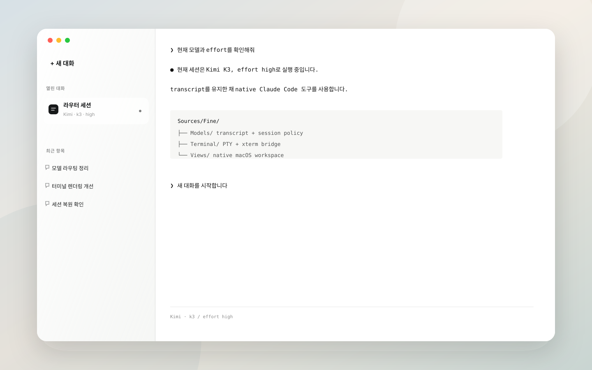
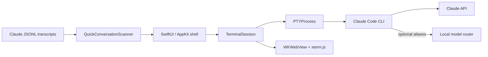

# Fine



Fine is a lightweight native macOS workspace for long-running Claude Code
conversations. It combines a translucent conversation index with a focused
xterm.js workspace, while every conversation remains a real resumable Claude
Code session.

## Why Fine

Terminal multiplexers are powerful, but they are not designed around
conversation history. Fine treats the transcript as the durable object:

- open a blank or prompted conversation in one step;
- resume any Claude transcript by its session ID;
- restore the exact model and effort used by that transcript;
- keep several live conversations in native macOS windows;
- route Claude-compatible model aliases through an optional local gateway.

Fine intentionally stays small. There is no embedded database, account layer,
Electron runtime, or background terminal server.

## Interface

- **Native AppKit shell** with independent macOS windows and restoration.
- **Glass conversation rail** for open sessions and recent transcript history.
- **Flat white terminal canvas** with WebGL-accelerated xterm.js rendering.
- **Compact terminal chrome** showing the active provider, model, and effort.
- **Clean Claude surface** that replaces the verbose built-in footer hint.
- **Korean-first labels** with native IME composition and CJK-safe rendering.

## Engineering highlights

### Real PTY lifecycle

Each tab owns a direct pseudo-terminal process. Fine propagates terminal
resizes, handles process-group cleanup, and prevents detached Claude children
from surviving a closed window.

### Transcript-aware resume

Fine scans Claude's local JSONL transcripts, extracts stable session metadata,
and preserves the selected model and effort per conversation. Resume launches
explicitly clear inherited child-session markers so future transcripts remain
durable.

### Native model routing

Claude models run directly. Codex, Kimi, and Gemini aliases can be discovered
from a local Anthropic-compatible router at `127.0.0.1:4141`. The terminal
still runs Claude Code itself, so tool calls, permission handling, transcript
storage, and session resume remain native.

### Deliberately small state model

Window geometry and composer preferences use macOS defaults. Session
configuration is stored as a compact local mapping. Claude's own transcript
files remain the source of truth for conversation history.

## Architecture



```text
Sources/Fine/
├── Models/       session policy, transcript scanning, window state
├── Terminal/     PTY lifecycle, xterm bridge, palette and web resources
└── Views/        sidebar, composer, terminal workspace and window binding
```

## Requirements

- macOS 14 or later
- Xcode 16 or a compatible Swift 6 toolchain
- Claude Code CLI
- the local `ccv` launcher at `~/myworld/ccv`
- optionally, a compatible model router on `127.0.0.1:4141`

Fine creates `~/cld` as its conversation workspace when needed. The `ccv`
launcher is a local integration boundary rather than part of this repository:
it starts Claude Code with the selected model, effort, resume ID, and optional
gateway environment.

## Build, test, and package

```sh
swift test
./scripts/package-app.sh release
```

The packaging script builds and ad-hoc signs `.build/Fine.app`.

```sh
ditto .build/Fine.app /Applications/Fine.app
open /Applications/Fine.app
```

## Keyboard shortcuts

| Shortcut | Action |
| --- | --- |
| `Command-N` | Open a new Fine window |
| `Command-T` | Start a blank conversation |
| `Command-Shift-[` | Select the previous live conversation |
| `Command-Shift-]` | Select the next live conversation |

## Design notes

The visual and interaction constraints are documented in
[DESIGN.md](DESIGN.md). The implementation favors native materials, restrained
contrast, and measured spacing rather than floating card-heavy UI.

## Privacy

Fine does not upload credentials, copy OAuth tokens, or maintain its own
conversation database. It invokes local tools and reads local Claude transcript
metadata. Provider authentication remains owned by the corresponding local CLI
or router.

## License

MIT. See [LICENSE](LICENSE). Bundled terminal components are documented in
[THIRD_PARTY_NOTICES.md](THIRD_PARTY_NOTICES.md).
